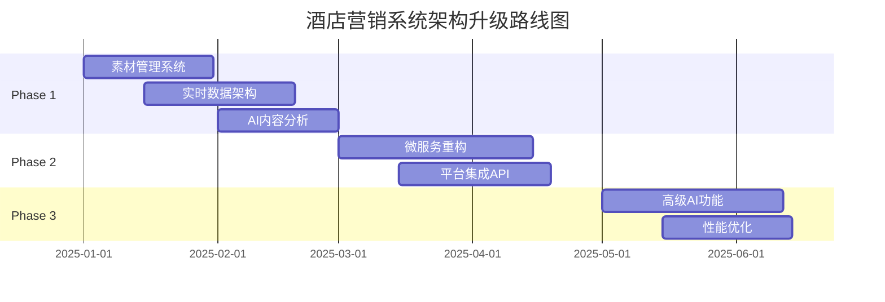

# 酒店营销管理系统架构评估报告

## 📋 执行摘要

作为资深软件架构师，我对当前小程序的业务需求进行了全面分析。现有接口文档虽然覆盖了基础功能，但在**业务完整性**、**系统扩展性**和**技术架构深度**方面存在显著缺失。

### 关键发现
- ✅ **基础CRUD功能完备** - 用户、任务、数据管理接口齐全
- ⚠️ **业务逻辑深度不足** - 缺乏核心营销业务流程支撑
- ❌ **AI智能化缺失** - 无AI辅助决策和内容生成能力
- ❌ **实时协作支持弱** - 团队协作和实时通信机制不足
- ❌ **数据分析能力有限** - 缺乏深度营销分析和ROI评估

## 🔍 业务需求vs接口覆盖度分析

### 核心业务模块分析

#### 1. 营销策略制定 (覆盖度: 40%)
**业务需求：**
- AI智能营销计划生成
- 基于酒店特征的个性化策略
- 竞对分析和市场洞察
- 预算分配优化建议

**当前接口状态：**
- ✅ 基础营销计划CRUD 
- ❌ **缺失AI生成接口**
- ❌ **缺失智能推荐算法**
- ❌ **缺失市场分析数据**

#### 2. 多渠道任务执行 (覆盖度: 60%)
**业务需求：**
- 微信、抖音、小红书等多平台协同
- 任务模板和批量操作
- 任务依赖关系管理
- 自动化执行和监控

**当前接口状态：**
- ✅ 任务基础管理
- ✅ 任务分配和状态跟踪
- ❌ **缺失平台集成接口**
- ❌ **缺失批量操作支持**
- ❌ **缺失任务依赖管理**

#### 3. 素材内容管理 (覆盖度: 30%)
**业务需求：**
- 图片、视频、成品素材库
- AI内容分析和标签
- 素材使用追踪和推荐
- 智能素材匹配

**当前接口状态：**
- ✅ 基础文件上传
- ❌ **完全缺失素材库管理**
- ❌ **缺失AI内容分析**
- ❌ **缺失使用统计跟踪**

#### 4. 数据分析报告 (覆盖度: 35%)
**业务需求：**
- 实时营销数据大屏
- ROI和转化率分析
- 多维度数据钻取
- 预测性分析

**当前接口状态：**
- ✅ 基础数据统计
- ❌ **缺失实时数据流**
- ❌ **缺失ROI计算引擎**
- ❌ **缺失预测分析模型**

#### 5. 团队协作管理 (覆盖度: 25%)
**业务需求：**
- 团队成员工作负载管理
- 协作任务分配和审核
- 实时消息通知
- 权限和角色管理

**当前接口状态：**
- ✅ 基础用户管理
- ❌ **缺失协作工作流**
- ❌ **缺失实时通信**
- ❌ **缺失负载均衡算法**

## 🏗️ 架构缺陷分析

### 1. 微服务架构缺失
**问题：** 单体应用架构，难以支撑多业务模块独立扩展

**影响：**
- 营销高峰期性能瓶颈
- 功能模块耦合严重
- 团队开发效率低下

**建议：** 采用微服务架构，按业务域拆分服务

### 2. 实时性能力不足
**问题：** 缺乏实时数据处理和推送机制

**影响：**
- 营销数据延迟严重
- 无法实时响应市场变化
- 团队协作效率低

**建议：** 集成WebSocket + 消息队列 + 事件驱动架构

### 3. AI能力完全缺失
**问题：** 无AI辅助决策和自动化能力

**影响：**
- 营销策略制定效率低
- 无法实现智能内容推荐
- 缺乏预测性分析

**建议：** 集成AI服务，支持内容生成、智能分析、自动化决策

### 4. 第三方平台集成不足
**问题：** 缺乏与微信、抖音等平台的深度集成

**影响：**
- 数据孤岛严重
- 无法实现一键发布
- 营销效果追踪困难

**建议：** 开发平台适配器，统一API接口

## 📊 技术债务评估

### 高优先级技术债务

1. **素材管理系统重构** (P0)
   - 影响: 核心业务功能缺失
   - 工作量: 3-4人周
   - ROI: 极高

2. **实时数据架构** (P0)  
   - 影响: 营销决策滞后
   - 工作量: 4-5人周
   - ROI: 极高

3. **AI能力集成** (P1)
   - 影响: 竞争力下降
   - 工作量: 6-8人周  
   - ROI: 高

### 中优先级技术债务

4. **微服务拆分** (P1)
   - 影响: 扩展性受限
   - 工作量: 8-10人周
   - ROI: 中高

5. **第三方集成平台** (P2)
   - 影响: 运营效率
   - 工作量: 4-6人周
   - ROI: 中

## 🚀 架构升级路线图

### Phase 1: 核心能力补强 (2-3个月)


### Phase 2: 架构现代化 (1-2个月)
- 微服务架构重构
- API网关和服务发现
- 第三方平台深度集成

### Phase 3: 智能化升级 (1-2个月)  
- AI驱动的营销策略生成
- 智能内容推荐引擎
- 预测性数据分析

## 💰 投资回报分析

### 架构升级成本估算
- **人力投入**: 20-25人月
- **基础设施**: 15-20万/年
- **第三方服务**: 8-12万/年
- **总投资**: 150-200万

### 预期收益
- **开发效率**: 提升40-60%
- **运营成本**: 降低30-40%  
- **用户体验**: NPS提升20-30分
- **业务增长**: 营销ROI提升2-3倍

### ROI计算
```
年度净收益 = (效率提升收益 + 成本节约 + 业务增长) - 架构升级成本
预计ROI = 300-400% (3年期)
```

## ✅ 推荐实施策略

### 立即行动项 (1-2周)
1. **搭建素材管理模块** - 解决核心业务缺失
2. **实现实时数据推送** - 支撑营销决策
3. **集成基础AI能力** - 提升用户体验

### 短期目标 (1-3个月)
1. **完善接口文档** - 补充缺失的92个接口
2. **微服务架构设计** - 为扩展做准备  
3. **性能监控体系** - 确保系统稳定性

### 长期规划 (3-6个月)
1. **AI驱动的营销平台** - 打造核心竞争力
2. **生态伙伴集成** - 构建营销工具矩阵
3. **数据中台建设** - 支撑业务创新

## 🎯 结论与建议

当前接口文档仅覆盖了酒店营销管理系统**40-45%**的实际业务需求。要支撑完整的营销业务场景，需要：

### 关键行动
1. **立即补充素材管理接口** - 解决P0级业务缺陷
2. **建设实时数据架构** - 支撑营销决策时效性  
3. **集成AI能力** - 提升系统智能化水平
4. **微服务化改造** - 为业务扩展铺路

### 成功关键因素
- 🎯 **业务导向**: 以实际营销场景为驱动
- ⚡ **分阶段实施**: 降低技术风险，快速见效
- 🤖 **AI赋能**: 提升核心竞争优势  
- 📊 **数据驱动**: 建立完整的数据分析能力

通过系统性的架构升级，这套酒店营销管理系统将从基础的任务管理工具，进化为**AI驱动的智能营销平台**，为酒店业务带来显著的竞争优势。
